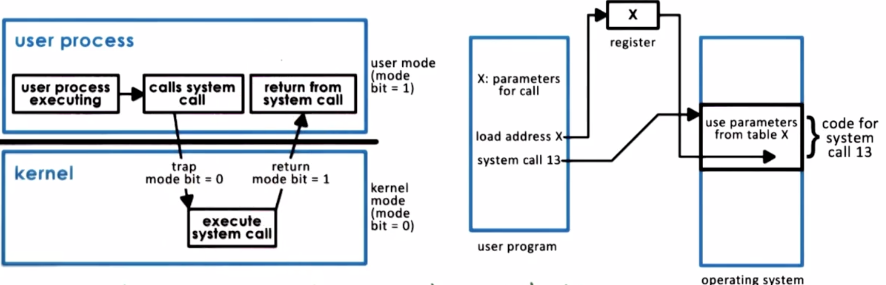
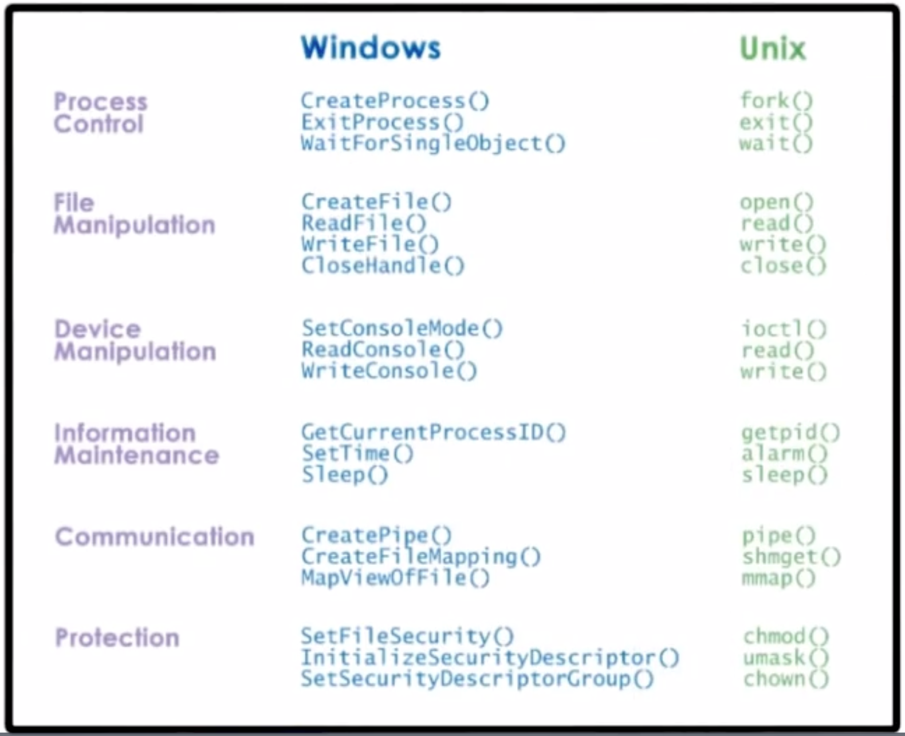
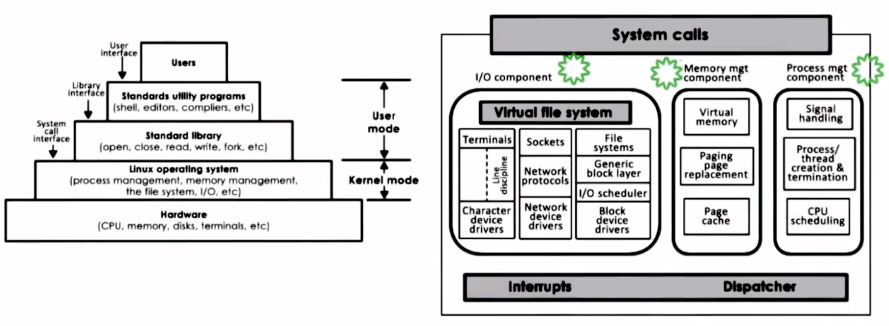
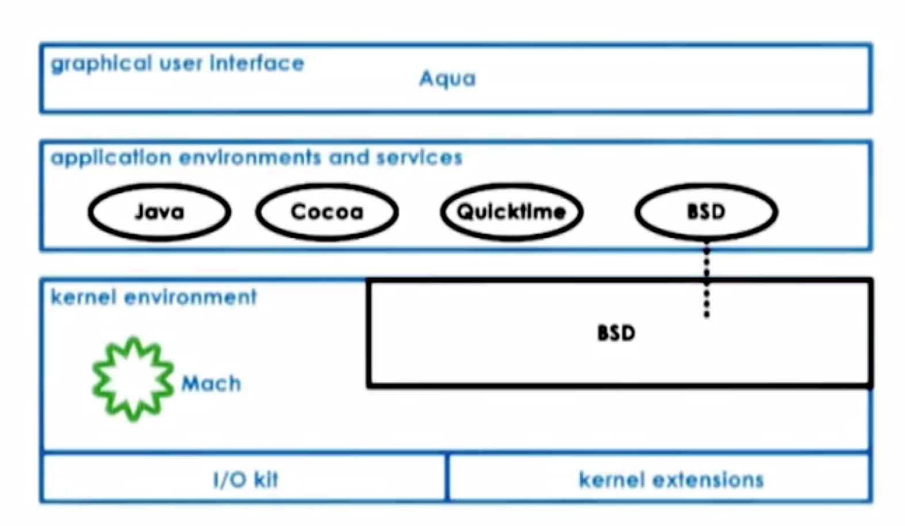

# P1L2 Introduction to Operating Systems

## Lesson Preview
- operating system (OS) definition
- key components of OS
- design and implementation consideration

## OS Definition
OS is special software to abstract(simplify) and arbitrate(manage) underlying hardware system.
- direct operating resources - control use of cpu, memory, peripheral devices
- enforce working policies - fair resource access, limits to resource usage
- mitigate difficulty for complex tasks - abstract hardware details, interact with applications via system calls

It accomplish these by
- hide hardware complexity - abstract network to socket(send/recv) and storage to file(read/write)
- manage resources - allocate memory to applications and schedule applications onto cpu, control access of applications to devices
- provide isolation and protection - allocate different parts physical memory for different applications to ensure they don't read or overwrite each other's memory

Some samples of OS
- desktop - windows, unix-based (**linux**, bsd)
- mobile - ios, android, symbian

## OS Elements
There are three types of elements in OS
- abstractions - e.g. process, thread, file, socket, memory page
- mechanisms - allow it to manipulate abstractions, e.g. create, schedule, open, write, allocate
- policies - specify how those abstractions can be modified, e.g. least-recently used(LRU), earliest deadline first(EFG)

Memory management example
- abstraction - memory page abstraction corresponds to some addressable region of memory of fixed size
- mechanism -  allocate memory page in DRAM, map the page to process address
- policy - use LRU to decide the page that will no longer be in physical memory and instead copied on disk

## OS Design principles
- separate mechanism and policy - implement flexible mechanisms to support many policies
- optimize for common case - understand scenarios, user behaviors, workload requirements

## System call
### User/kernel protection boundary
- user-level unprivileged mode - used by applications 
- kernel-level privileged mode - os kernel privileged direct hardware access
- user-kernel switch - supported by hardware via trap instructions, system calls and signals

### System call flow

1. User process needs to perform access to hardware or request change in allocations
    1. save relevant data at well-defined location
    2. make system call using the specific system call number
    3. change execution context from user mode into kernel mode
    4. arguments can be passed directly from program to OS or indirectly by specifying their address
2. OS performs the operation and returns the results back and control to the process
    1. change execution context from kernel mode into user mode
    2. pass any arguments back to the user address space
    3. jump to the exact same location in the execution of the user process where the system call was made from
3. In synchronous mode, the process will wait until the system call completes

A system call involves
- changing execution context from user to kernel mode and back
- passing arguments
- jumping around in memory to locations where the code to be executed is

### Cross user/kernel boundary
User/kernel transitions are necessary and not cheap
- hardware supported - traps on illegal instructions or memory accesses requiring special privilege
- involves a number of instructions - takes ~50~100ns on a 2GHz machine running linux
- switches locality - affects hardware cache

### OS Services
OS services are exported by OS to allow applications to access underlying hardware.
- low-level services linked with abstractions that really map to hardware - scheduler, memory manager, block device driver
- higher-level services linked with higer-level abstractions - file system

##OS Organizations
### Monolithic OS
Monolithic OS is a historical design including all services and hardware.
- pros
    - everything is included
    - inlining, compile time optimizations
- cons 
    - too much state and code make it hard to debug and maintain
    - large memory requirement has negative performance impact

### Modular OS
Modular OS is mordern design with a number of basic services and APIs already as part of it and everything can be added as a module by implementing interface.
- pros
    - easier to maintain and upgrade
    - smaller codebase
    - less resource needs can improve performance
- cons 
    - going to interface first than service directly may impact performance
    - maintenance is still an issue given that modules come from disparate codebase which may even have bugs

### Microkernel
Microkernel only require the most basic primitives at OS level such as address space, thread and inter-process communications, while all other software components will run outside at user level.

- pros
    - very small size
    - easy to verify and test
- cons 
    - questionable portability as it's very customized to the underlying hardware
    - hard to find common software increases complexity of software development
    - frequent expensive user/kernel transitions

### Examples
Linux

Mac OS

