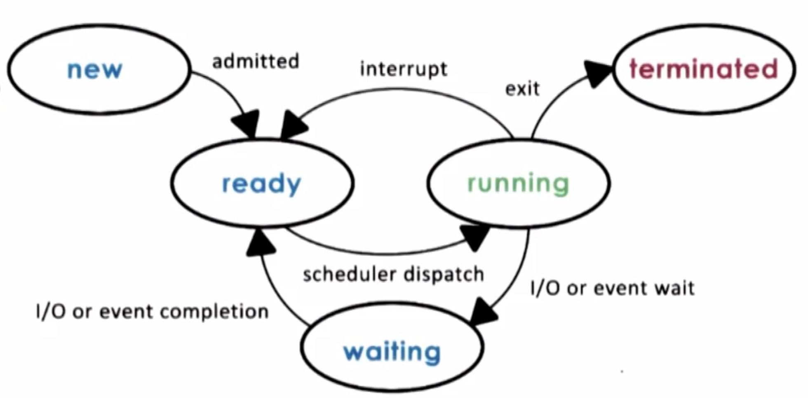

# Processes and Process Management

## Lesson Preview
- process definition
- process related abstractions - address space, PCB
- key mechanisms for process management
- memory managements aspects associated with process management

## Process Definition
Process represents an execution state of an active application, synonymous with task or job.
- state of execution - program counter, stack
- parts and temporary holding area - data, register state, occupies state in memory
- special hardware requirement - i/o devices

A process encapsulates all the data for running the application in address space. Every single state needs to be identified by its address from V0 to Vmax.
- test & data - static state when process first loads
- heap - dynamically created during execution
- stack - LIFO queue grows and shrinks during execution

## Address Space
Address space is the in memory representation of a process.
 - virtual addresses - V0 to Vmax used by a process
 - physical addresses - locations in physical memory
 - page tables - mapping of virtual to physical addresses

Address space and memory management
- parts of virtual address spaces can not be allocated
- when physical memory is not enough for all state, a portion of address can be swapped temporarily on disk
- different processes can have the same virtual address space

## Process Control Block (PCB)
OS creates a PCB for a process when it's create. It can help OS know the process execution state.
- program counter - which instruction sequence the process is in binaries
- cpu registers - addresses for data or status information that could affects the execution of instruction sequence
- stack pointer - top of the stack in address space
- others - e.g. process number, memory limits, open file list, priority, signal mask, scheduling info

Context switch is switching the cpu from one process execution to another.
- cpu has a dedicated register to track current executing program counter to handle the issue caused by frequently updated fields like program counter.
- when os interrupts a process to idle, it saves all the state information of the process including cpu registers to PCB 
- when os decides to execute a process, it updates cpu registers with PCB for the process

Context switch is expensive and we need to limit its frequency.
- direct costs: number of cycles for load & store instructions
- indirect costs: cold cache or cache misses

## Process Lifecycle

### Process creation
A process can create child process in two ways.
- fork
    - copy parent PCB into child PCB
    - child continues execution at instruction after fork
- exec
    - replace child image
    - load new program and start from first instruction

Different platforms have different root processes.
- on unix-based os - init is the parent of all processes
- on android os - zygote is the parent of all app processes

### Process scheduling
A cpu scheduler determines which ready process to be dispatched to cpu and how long it should run for.
- appropriate timeslice - time allocated to a process on cpu
- reasonable metrics to choose next process to run

In order to manage cpu, OS mush be efficient.
- preempt - interrupt and save current context
- schedule - run scheduler to choose next process
- dispatch - dispatch process and switch into its context

### Back to ready state
A process can make its way into the ready queue in several ways.
- i/o request -> i/o queue -> i/o -> ready queue
- time slice expired -> ready queue
- fork a child -> child executes -> ready queue
- wait for interrupt -> interrupt occurs -> ready queue

### Process interact
Inter-process communication (IPC) mechanisms can
- transfer data/info between address spaces
- maintain protection and isolation
- provide flexibility and performance

IPC mechanisms supported by OS
- message-passing IPC - OS provides communication channel like shared buffer for processes to send/recv messages to/from channel
- shared memory IPC - OS established a shared channel and maps it into each process address space for processes to read/write from this memory
