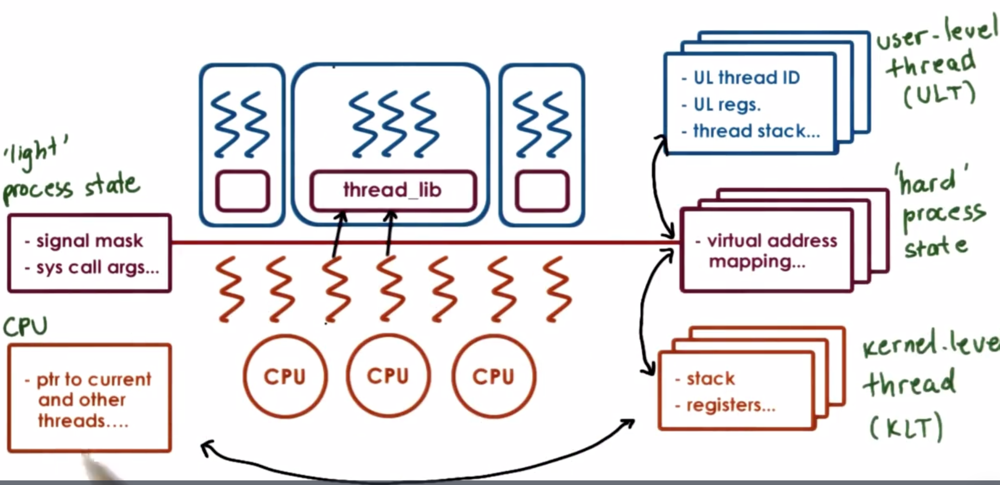
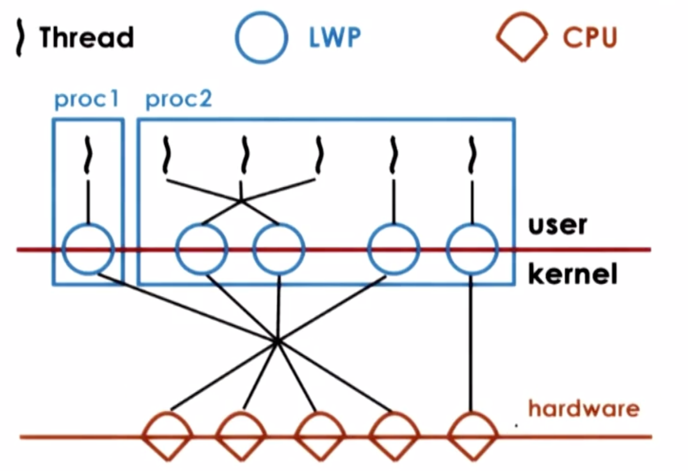
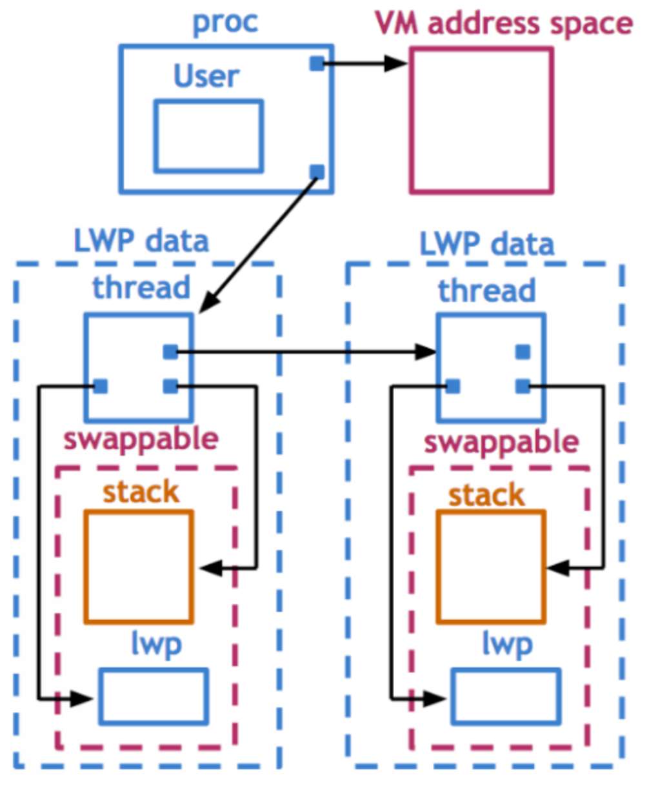
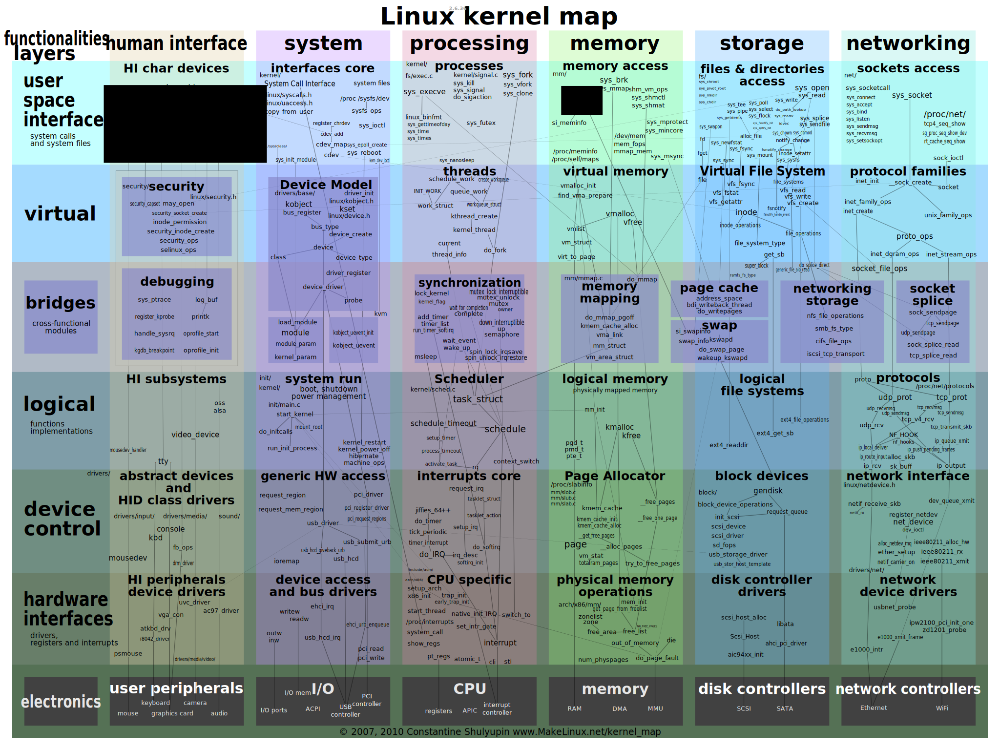

# Thread Design Considerations

## Lesson Preview
- user/kernel-level threads implementation
- threads and interrupts
- threads and signal handling
- linux threading models

## Data Structures for Threads
For better scalability, overheads, performance, flexibility, we need to maintain multiple data structures instead of a single PCB.


### user-level structures in Solaris 2.0

- not POSIX threads, but similar
- thread creation
    - thread id (tid) - index into table of pointers
    - table pointers point to per thread data structure
- structure contains execution context, registers, signal mask, priority, stack pointer, thread local storage, stack
- red zone throws error when a thread stack overwrite other's

### kernel-level structures Solaris 2.0

process
- kernel-level threads list
- virtual address space
- user credentials
- signal handlers

lightweight process (LWP) is similar to ULT but visible to kernel and not needed when process not running
- user-level registers
- system call args
- resource usage info
- signal mask

kernel-level threads with information needed even when process not running so it's not swappable
- kernel-level registers
- stack pointer
- scheduling info
- pointers to associated LWP, process, cpu structures

cpu tracks information with a dedicated register that points to current thread
- current thread
- kernel-level threads list
- dispatching and interrupt handling information

### Thread management interactions
As user-level library and kernel doesn't know what's happening in the other side, system calls and special signals allow kernel and ULT lib to interact and coordinate.
- kernel sends notification signal to user-level lib before it blocks KLT
- in response, user-level lib can ask kernel to get more LWPs/KLTs
- then user-level lib can start scheduling the remaining ULT onto associated LWP

Process jumps into UL lib scheduler on
- ULT operations
    - ULT explicitly yield
    - ULT calls lib functions like lock/unlock
    - blocked threads become runnable
- signals from timer or kernel

### Issues and optimizations
- visibility - in many-to-many model, UL scheduling-made decisions, mutex and wait queues are invisible to kernel, it could change ULT-KLT mapping. So we needs 1-to-1 to help
- multiple cpus - we can't directly modify registers of on cpu when executing on another. So this thread sends signal to other KLT on other cpu to run library code locally
- adaptive mutexes - with multiple cpus, if critical section is short, we'd better off spinning than block by picking a thread, context switching it and queueing it up on a mutex queue
- destroying threads - put exited thread on death row and periodically destroy them by reaper thread, then we can reuse the allocations of threads in death row

## Interrupts vs. Signals
|           |         interrupts        |          signals         |
|-----------|:-------------------------:|:------------------------:|
| trigger   | components other than cpu | cpu                      |
| based on  | physical platform         | OS                       |
| sync      | asynchronous              | synchronous/asynchronous |
| unique id | hardware                  | OS                       |
| mask      | per cpu                   | per execution context    |
| handler   | for entire system         | on per process basis     |
| metaphor  | snowstorm warning         | low battery warning      |

### Handlers
interrupts handler table maps from each int#(msi#) to corresponding starting address of handler

signal handler table maps signal# defined by os to starting address of handler
- OS defines default actions
- process installs handler

signal# in [posix standard](http://pubs.opengroup.org/onlinepubs/9699919799/)
- synchronous - SIGSEGV, SIGFPE, SIGKILL
- asynchronous - SIGKILL, SIGALARM

signal types
- one-shot signals - n signals pending means 1 signal pending
- real time signals - n signals raised then handler will be called n times

### Masks
When interrupts/signals come, pc points to first instruction in handler, stack pointer still points to same thread stack.
- prohibit handling code to use mutexes - too restrictive
- control interruptions by handler code - use interrupt/signal masks

### Interrupts as threads
To avoid deadlock, make interrupt a full fledged thread.
- dynamic decision - if handler has mutexes turn it into a separate thread, otherwise, execute on interrupted thread's tack
- optimization - pre-create and pre-initialize a few thread structures for interrupt routines

Top vs. bottom half
- top half execute immediately after interrupt occurs - fast, non-blocking, min amount of processing
- bottom half can be scheduled like any other thread - arbitrary, complexity

Performance: bottom line
- creating a thread to handle interrupt add an overhead of 40 sparc instructions
- no change to interrupt mask save 12 instructions per mutex 
- fewer interrupts than mutex lock/unlock operations

### Threads and signal handling
#### Case study
- ULT mask = 1, KLT mask = 1
    - kernel sees the signal is enables and it will interrupt the currently running ULT on top of this KLT
    
- ULT mask = 0, KLT mask = 1, another ULT mask = 1
    - use a library handling routine to wrap the signal handling routine in handler table
    - execute library provided handler when a signal occurs which can see all masks of ULTs
    - library routine invokes library scheduler to make the other ULT with enabled mask on queue to run on this KLT

- ULT mask = 0, KLT mask = 1, another ULT mask = 1, another KLT mask = 1
    - library routine generates a direct signal to the KLT associated with the ULT with enabled mask
    - then it becomes the first case since both ULT and KLT have enabled mask
    
- ULT mask = 0, KLT mask = 1, another ULT mask = 0, another KLT mask = 1
    - library routine finds no ULT with enabled mask so it requests the KLT to disable its mask
    - when lib reissues the signal for entire process again, OS finds there's another KLT with enabled mask, then this KLT mask will be disabled just like the previous one
    - signal remains pending and the previous step will be repeated this and disable all KLT signal masks
    - until a ULT mask is enabled, the library will perform a system call to enable a KLT mask

#### Common case optimization
- signals occur much less frequently than signal mask updates
- updates signal mask just apply to UL mask then system calls to change kernel are avoided 
- signal handling becomes complex but cheaper

## Tasks in Linux

### Task structure
Task is the execution context of KLT created with `clone(function, stack_ptr, sharing_flags, args)`.
```
struct task_struct { 
    pid_t pid;
    pid_t tgid;
    int prio;
    volatile long stae;
    struct mm_struct *mm;
    struct files_struct *files;
    struct list_head tasks;
    int on_cpu;
    cpumask_t cpus_allowed;
    ...
}
```

### Linux threads model
- older linux uses many-to-many model
    - UL scheduling-made decisions, mutex and wait queues are invisible to kernel, it could change ULT-KLT mapping
- current linux uses 1-to-1 model - native posix threads library (NPTL)
    - unlike many-to-many, now kernel is able to see each ULT info
    - kernel traps have become cheaper than before
    - modern platforms support more resources, e.g. memory, large id range

## References
- [Eykholt, J.R., et. al., Beyond Multiprocessing: Multithreading the Sun OS Kernel](papers/ud923-eykholt-paper.pdf)
- [Stein, D. and D. Shah, Implementing Lightweight Threads](papers/ud923-stein-shah-paper.pdf)
- [Interactive Linux Kernel Map](https://makelinux.github.io/kernel/map/)