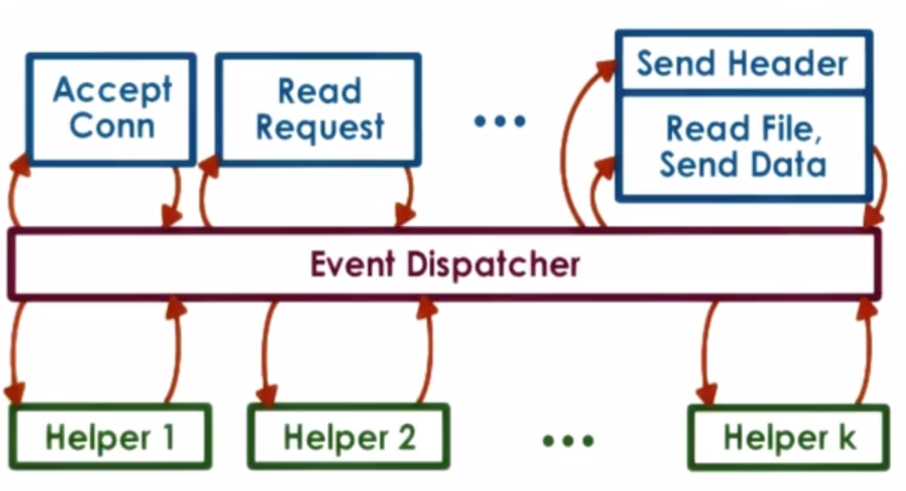
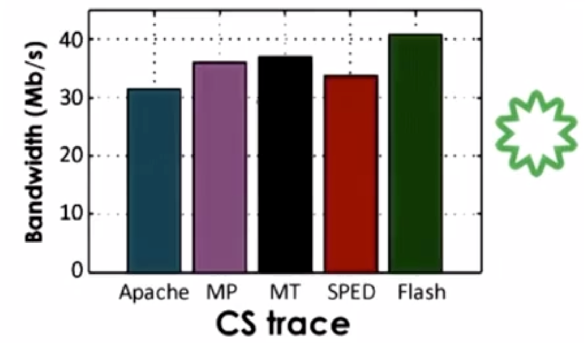

# Thread Performance Considerations

## Lesson Preview
- event-driven model
- performance comparisons - MP vs. MT vs. event-driven
- experimental design

## Performance Metrics
Metric is a quantified measurement standard that can be used to evaluate the system behavior we're interested in.
- execution time - whole completion time
- throughput - process completion rate
- cpu utilization - working percentage of cpu
- request rate - frequency of incoming requests
- response time - average time to respond to input
- wait time - how sooner a job starts being executed
- platform efficiency - ratio of throughput over resources
- performance per $/w - earning over spending
- percentage of SLA violations - chance of SLA overdue
- client-perceived performance - e.g. eyes can't perceive > 30 frames/s
- aggregate performance - e.g. average execution time for all tasks
- average resource usage - e.g. memory, file system

Make experiments to obtain metrics.
- experiments with real software deployment, real machines, real workloads
- toy experiments representative of realistic settings
- supplement toy experiments with simulation of larger system

## Event-Driven Model
### How it works
Event-driven has single address space, process and thread. Many requests interleaved in an execution context.
- event dispatcher is like a state machine continuously looking for incoming events
- then calls the proper registered handler based on the event by jumping to corresponding address space
- event is input on file descriptors (FD), e.g. sockets, files, and linux use `select`/`poll`/`epoll` to choose FD and catch events

### Why it works
1 cpu "threads hide latency"
- if t_idle > 2*t_ctx_switch, switch context to hide latency
- if t_idle = 0, context switching wasts cycles that could have been used for request processing

Event-driven also works for multiple cpus
- also useful when request# >> cpu# 
- single event-driven process per cpu

### Benefits
- single address space and single flow of control
- no context switching and smaller memory requirement
- no synchronization and simple implementation

### AMPED/AMTED
The problem of event-driven model occurs when a bocking request/handler blocks the entire process.

Asynchronous i/o operations
- OS obtains all relevant info from stack and either learns where to return the results or tells caller where to get results
- requires support from kernel (e.g. threads) and device (e.g. DMA)

With helpers, it evolves to asymmetric multi-process/thread event driven model (AMPED/AMTED).
- designated for blocking i/o operations only
- pipe/socket based communication with event dispatcher
- helper blocks but main event loop and process don't

Pros & cons
- \+ resolve portability limitations of basic event-driven model
- \+ smaller footprint than regular worker thread as helpers created only for blocked i/o calls
- \- applicability to certain classes of applications
- \- complexity of routing event on multi cpu systems

### Flash vs. Apache
- Flash is an event-driven web server (AMPED)
    - helpers used for disk read
    - pipes used for communication with dispatcher
    - helper reads file in memory via mmap
    - dispatcher checks via mincore if pages are in memory to decide use local handler or helper
    - common optimization for web server 
        - application-level caching
        - use of DMA with scatter-gather to vector i/o operations
        - alignment for DMA
- Apache is a combination of multiprocess and multi-threaded model
    - flow of control is similar to event-driven model
    - each process is single boss/worker with dynamic thread pool
    - processes# can also be dynamically adjusted

## Experimental Design
### Flash perf experiments
#### Setup
- comparision points
    - MP (each process single thread)
    - MT (boss/worker)
    - single process event-driven (SPED)
    - Zeus (SPED with 2 processes)
    - Apache (v1.3.1, MP) *
- inputs
    - realistic request workload - distribution of web page accesses over time
    - controlled, reproducible workload - trace-based from real web servers
        - cs web server & owlnet trace (rice univ)
        - synthetic workload generator to replay the traces
- metrics
    - bandwidth - bytes/time
    - connection rage - request#/time
    - how these two will be impacted by file size
    
#### Raw results

- MT better than MP
    - smaller memory footprint
    - cheaper sync
- SPED worst
    - lacks async i/o
- Flash best
    - smaller memory footprint
    - more memory for caching 
    - fewer requests blocking i/o further speed thing up
    - no sync needed
- Apache
    - no cache for directory lookup, file, header
    
#### Summary of performance results
- when data is in cache
    - SPED >> AMPED Flash - Flash has unnecessary test for memory presence
    - SPED and AMPED Flash >> MT/MP - MT/MP has sync & context switching overhead
- with disk-bound workload
    - AMPED Flash >> SPED - SPED without async i/o blocks
    - AMPED Flash >> MT/MP - Flash is more memory efficient and has less context switching
    
### Advices
- make experiment relevant - set goals to meet for stakeholders
- pick right metrics - standard, can answer questions
- pick right configuration space - system resources, workload
- compare system - state-of-the-art, common practice, ideal best/worst
- visualize results - chart, table
- make conclusions - support claims

## References
- [Pai V S, Druschel P, Zwaenepoel W, et al. Flash: an efficient and portable web server](papers/ud923-pai-paper.pdf)
